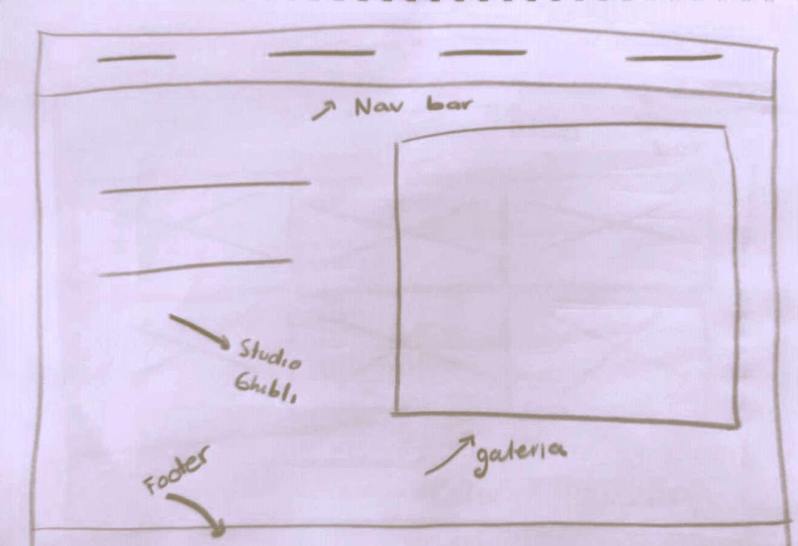
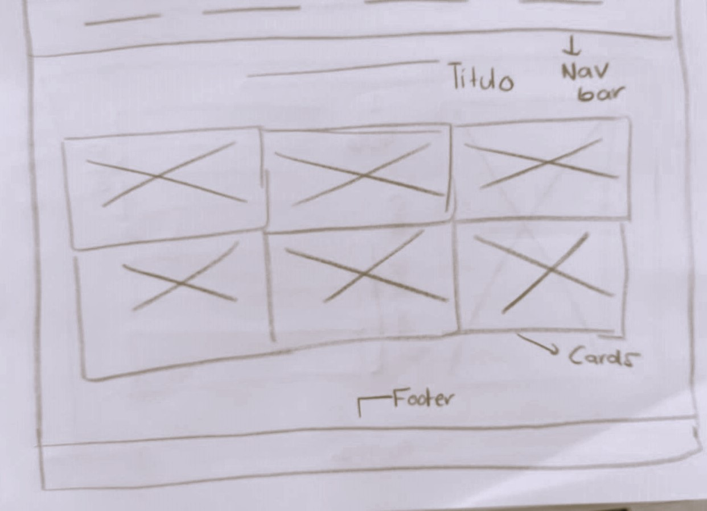
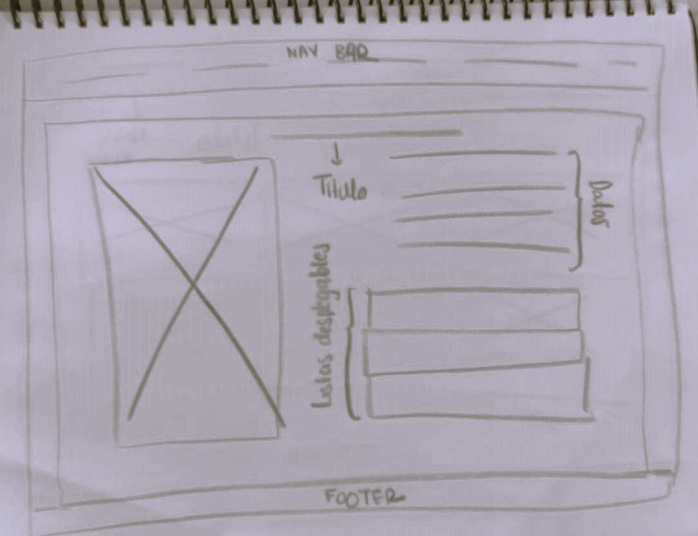
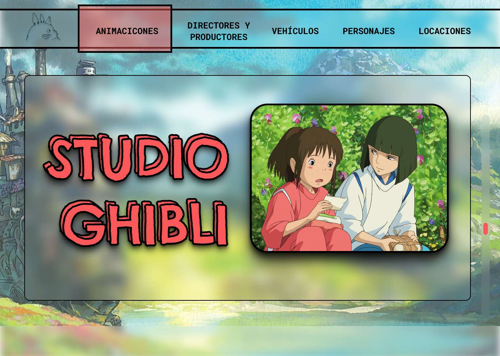
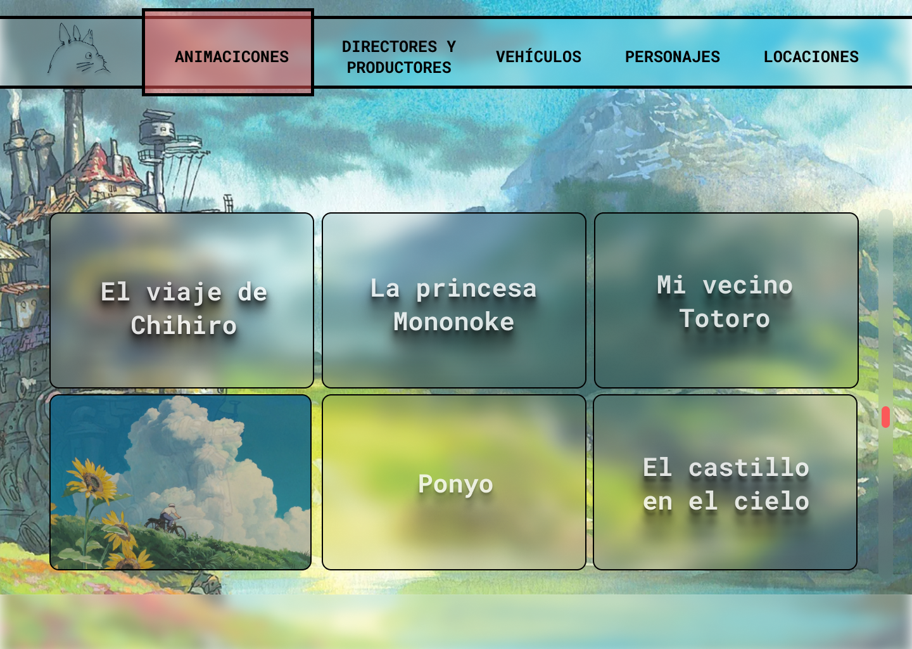
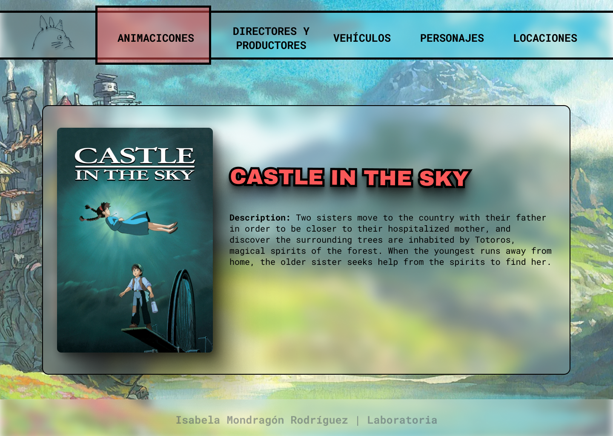

# DATA LOVERS: STUDIO GHIBLI ☘️💻

------------

Data Lovers: Studio Ghibli es una *single web application* que brinda a los fans de Studio Ghibli una forma interactiva y organizada de explorar y sumergirse en el fascinante mundo de las animaciones de este renombrado estudio de cine. Esta aplicación web permite a los usuarios acceder a una amplia gama de información sobre películas, directores, productores y personajes, presentando una experiencia enriquecedora que satisface la curiosidad y el amor por el cine de animación.

Con Data Lovers: Studio Ghibli, podrás:

- Filtrar la información por categoría, como directores, productores y personajes, para acceder de manera rápida y sencilla a los detalles que deseas explorar.
- Explorar listados detallados de elementos en cada categoría, obteniendo una visión completa de los personajes, directores y productores de las películas.
- Ordenar la información según diferentes criterios, como año, orden alfabético y puntuación, para explorar las animaciones de manera organizada.
- Acceder a detalles exhaustivos de cada animación, incluyendo su descripción, fecha de lanzamiento, peso y el equipo creativo detrás de ella.
- Obtener una visión de la amplitud de cada categoría al conocer la cantidad de elementos que se encuentran en ella.
- Descubrir el promedio de puntuaciones otorgadas a los directores y productores, lo que te permitirá apreciar la calidad del trabajo de cada uno.

------------
#### TABLA DE CONTENIDOS

  - [DEMO](#demo)
  - [DEFINICIÓN DEL PRODUCTO](#definición-del-producto)
  - [HISTORIAS DE USUARIO](#historias-de-usuario)
  - [PROTOTIPOS DE BAJA Y ALTA FIDELIDAD](#prototipos-de-baja-y-alta-fidelidad)
  - [PROBLEMAS DE USABILIDAD](#problemas-de-usabilidad)
  - [TECNOLOGÍAS OCUPADAS](#tecnologías-ocupadas)
  - [RECURSOS ÚTILES](#recursos-útiles)
------------
#### DEMO

------------

#### DEFINICIÓN DEL PRODUCTO 

La "*Definición de Producto*" es un conjunto de criterios que deben cumplirse antes de considerar una funcionalidad o característica como "terminada". Esta definición asegura que el producto esté completo, funcional y cumpla con los estándares de calidad establecidos. En el caso de Data Lovers: Studio Ghibli, se basa en los siguientes puntos:

- Prototipo de Baja y Alta Fidelidad: Se ha creado y validado un prototipo de baja fidelidad para planificar la estructura de la interfaz y un prototipo de alta fidelidad para simular la apariencia final del producto.

- Guía de Estilos: El diseño sigue la guía de estilos definida para mantener una apariencia coherente y profesional en todo el proyecto.

- Testeo de Usabilidad: Cada historia implementada ha sido sometida a pruebas de usabilidad con al menos tres usuarios. Se han recopilado sus comentarios y se han incorporado mejoras basadas en sus sugerencias.

- Completitud de HTML, JS y CSS: Las partes correspondientes del proyecto, incluyendo el marcado HTML, la lógica de programación JS y la hoja de estilos CSS, se encuentran implementadas y funcionales.

- Pruebas de Código: El código ha sido probado para asegurarse de que funcione como se espera y que no haya errores significativos.

- Commits Documentados: Cada implementación cuenta con commits descriptivos que explican los cambios realizados. Esto permite un seguimiento claro de las modificaciones realizadas a lo largo del tiempo.

Cumplir con estos criterios asegura que cada funcionalidad añadida al proyecto esté completa, probada y cumpla con los estándares de calidad definidos.

------------
#### HISTORIAS DE USUARIOS
Las "Historias de Usuario" son descripciones breves y centradas en el usuario de las funcionalidades clave que el producto debe ofrecer. Estas historias capturan los requisitos funcionales desde la perspectiva del usuario final. Para Data Lovers: Studio Ghibli, las siguientes historias de usuario fueron implementadas con éxito:

**US1. Filtrar la Información por Categorías**
Como fan apasionado de Studio Ghibli, quiero tener la posibilidad de filtrar la información por categorías en la plataforma, como directores, productores y personajes. Esto me permitirá acceder de manera rápida y sencilla a la lista de elementos específicos que deseo explorar.

**US2. Listado de Elementos en Cada Categoría**
Como fan de Studio Ghibli, quiero poder ver un listado de todos los elementos en cada categoría, como directores, productores y personajes. Esto me permitirá conocer cuáles son los involucrados en las películas y las características únicas de cada uno.

**US3. Ordenar la Información de Listados**
Como fan de Studio Ghibli, quiero tener la capacidad de ordenar la información en los listados por criterios como año, orden alfabético y puntuación. Esto me permitirá explorar las animaciones de manera organizada y acceder a la información de manera conveniente.

**US4. Explorar Detalles de Cada Animación**
Como fan de Studio Ghibli, quiero poder acceder a información detallada de cada animación, incluyendo descripción, fecha de lanzamiento, peso, director, productor y personajes. Esto me proporcionará una visión completa de cada película y su equipo creativo.

**US5. Ver la Cantidad de Elementos en Cada Categoría**
Como fan de Studio Ghibli, quiero poder ver la cantidad de elementos que se encuentran en cada lista, como "Directores y Productores" y "Personajes". Esto me dará una idea de la amplitud de cada categoría.

**US6. Promedio de Puntuaciones para Directores y Productores**
Como fan de Studio Ghibli, quiero conocer el promedio de puntuaciones que han recibido los directores y productores de las películas. Esto me permitirá apreciar la calidad del trabajo de cada uno y tomar decisiones informadas sobre mis favoritos.

Estas historias de usuario forman la base de la funcionalidad de Data Lovers: Studio Ghibli y guían la experiencia del usuario en la exploración de las animaciones del estudio. Cada historia ha sido implementada con éxito y contribuye a la riqueza de la aplicación.

------------

#### PROTOTIPOS DE BAJA Y ALTA FIDELIDAD

Los prototipos de alta y baja fidelidad son elementos esenciales en el proceso de diseño de Data Lovers: Studio Ghibli. Estos prototipos han sido creados utilizando las herramientas de diseño Figma y Zeplin, permitiendo visualizar y comunicar de manera efectiva cómo se verá y funcionará el producto final.

**BAJA FIDELIDAD**

 

**ALTA FIDELIDAD**

**LINK DE ZEPLIN**

[ZEPLIN](http://https://zpl.io/DlMrmzg "ZEPLIN")

------------

#### PROBLEMAS DE USABILIDAD

El test de usabilidad es una parte crucial en el proceso de desarrollo de Data Lovers: Studio Ghibli, ya que permite identificar áreas de mejora y optimizar la experiencia del usuario. A través de estas pruebas, se pudieron abordar diversas problemáticas y aplicar soluciones efectivas para garantizar que la plataforma sea intuitiva y satisfactoria para los usuarios. Aquí se presentan algunas de las observaciones y las soluciones implementadas:

**Legibilidad de la fuente debido a transparencia en contenedores.**
La transparencia de los contenedores afectaba la legibilidad de la fuente, dificultando la lectura del contenido. Se decidió bajar la transparencia en los contenedores y aplicar un filtro de desenfoque (*backdrop filter: blur*) para lograr una lectura más clara y agradable. El feedback posterior confirmó que esta solución mejoró la legibilidad sin comprometer la estética.

**Claridad en categoría actual.**
Los usuarios experimentaban confusión al no poder determinar en qué categoría se encontraban. Para abordar esto, se agregó un elemento que mostraba el nombre de la categoría actual. Esta adición brindó a los usuarios una referencia visual constante, permitiéndoles entender en qué parte de la plataforma se encontraban en todo momento.

**Información no visible al ordenar por año o puntaje.**
Al ordenar por año o puntaje, los datos relevantes no se mostraban en la tarjeta, lo que causaba confusión. Para solucionar esto, se incorporó la información de ordenamiento directamente en la renderización de las tarjetas. Esto proporcionó una experiencia más clara y coherente, permitiendo a los usuarios entender cómo se organiza la información.

**Navegación simplificada.**
Se introdujo un conjunto de botones de navegación (anterior y siguiente) en las tarjetas individuales. Esto permitió a los usuarios desplazarse fácilmente entre las animaciones sin tener que regresar a la lista completa. Esta mejora agilizó la exploración y facilitó la interacción con los detalles de cada película.

**Botón de regreso.**
Se añadió un botón de regreso en las páginas individuales de detalles para permitir a los usuarios volver rápidamente a la página principal. Esto eliminó la necesidad de utilizar el botón de retroceso del navegador, lo que mejoró la navegación general y la comodidad del usuario.

------------

#### TECNOLOGÍAS OCUPADAS 

Data Lovers: Studio Ghibli ha sido desarrollado utilizando un conjunto de tecnologías que permiten crear una experiencia de usuario fluida y atractiva. A continuación, se presentan las principales tecnologías utilizadas en este proyecto:

**HTML5**: El marcado HTML5 se ha empleado para estructurar la base del sitio web, proporcionando una organización lógica y semántica de los elementos en la página.

**CSS3**: Las hojas de estilo en cascada (CSS3) han sido utilizadas para dar vida al diseño visual de Data Lovers: Studio Ghibli. Con CSS3, se aplicaron estilos, diseños y efectos que contribuyen a la estética y atractivo del sitio.

**JavaScript (JS)**: El lenguaje de programación JavaScript ha sido esencial para agregar interactividad y dinamismo a la plataforma. A través de JS, se han implementado características como el filtrado, ordenamiento y detalles de animaciones, mejorando la experiencia del usuario.

**Jest**: Para asegurar la calidad del código y la funcionalidad del proyecto, se ha utilizado Jest, un framework de pruebas para JavaScript. Jest ha permitido realizar pruebas unitarias y garantizar que el software se comporte como se espera en diferentes escenarios.

------------

#### RECUERSOS ÚTILES
- [JavaScript | Event Keycodes](http://https://omatsuri.app/events-keycode "JavaScript | Event Keycodes")
- [Tema de color a partir de una imagen. ](http://https://color.adobe.com/es/create/image "Tema de color a partir de una imagen. ")
- [Los 23 métodos de array en JavaScript que debes conocer](http://https://lasfi.to/blog/metodos-array-javascript/ "Los 23 métodos de array en JavaScript que debes conocer")
- [Real Time Colors](http://https://realtimecolors.com/?colors=A67233-fefff2-5E7BB5-59A8D9-A5BF6B "Real Time Colors")
- [How I connect my Rails backend to the JS frontend](http://https://medium.com/swlh/how-i-connect-my-rails-backend-to-the-js-frontend-1e02c92966c2 "How I connect my Rails backend to the JS frontend")
- [CURSO FIGMA DESDE 0](http://https://www.youtube.com/watch?v=7BufKLx9LGs "CURSO FIGMA DESDE 0")
- [POKEDEX con API](http://https://www.youtube.com/watch?v=EmxvMPcIy5c "POKEDEX con API")